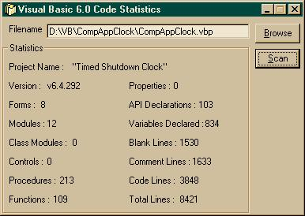

<div align="center">

## Code Statistics v2\.0


</div>

### Description

This will get various statistics of your code. it can scan projects, forms, modules, classes and controls. The informations retreived.. well, just look at the picture. The code is a definate improvement on the last version which only scanned projects, forms and modules. This version can scan classes and controls, plus gets the amount of declared variables, properties and api decalrations. The code itself has also been slightly re-structured for ease in inserting any other files you wish to scan for. Let me know if you have any suggestions, as these improvements were suggested in the feedback from the last version. Any votes are also appreciated :) Thank you.
 
### More Info
 


<span>             |<span>
---                |---
**Submitted On**   |2002-01-04 15:58:36
**By**             |[Eric O'Sullivan](https://github.com/Planet-Source-Code/PSCIndex/blob/master/ByAuthor/eric-o-sullivan.md)
**Level**          |Intermediate
**User Rating**    |4.5 (18 globes from 4 users)
**Compatibility**  |VB 6\.0
**Category**       |[Files/ File Controls/ Input/ Output](https://github.com/Planet-Source-Code/PSCIndex/blob/master/ByCategory/files-file-controls-input-output__1-3.md)
**World**          |[Visual Basic](https://github.com/Planet-Source-Code/PSCIndex/blob/master/ByWorld/visual-basic.md)
**Archive File**   |[Code\_Stati46261142002\.zip](https://github.com/Planet-Source-Code/eric-o-sullivan-code-statistics-v2-0__1-30393/archive/master.zip)

### API Declarations

```
'no api declarations
```


